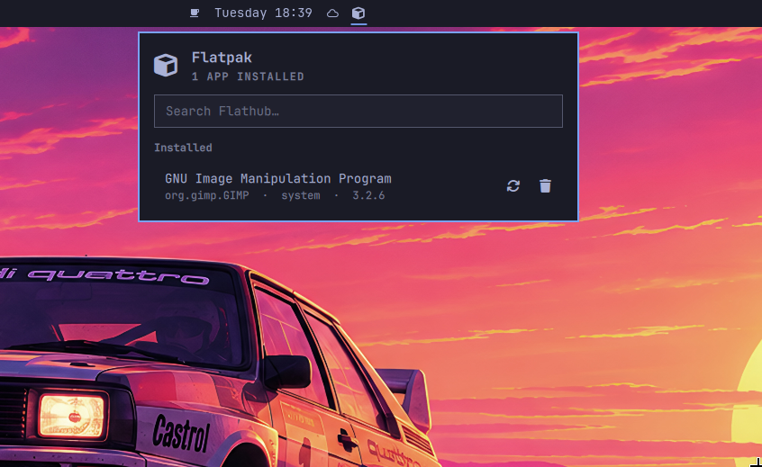
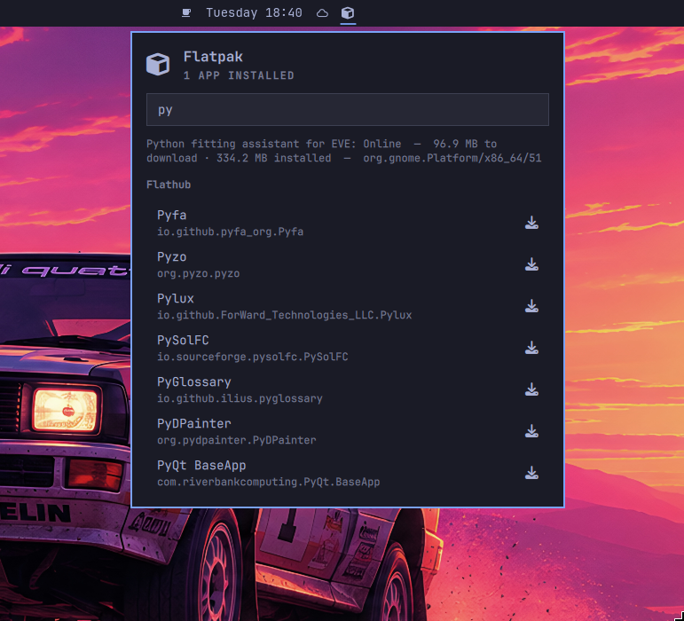
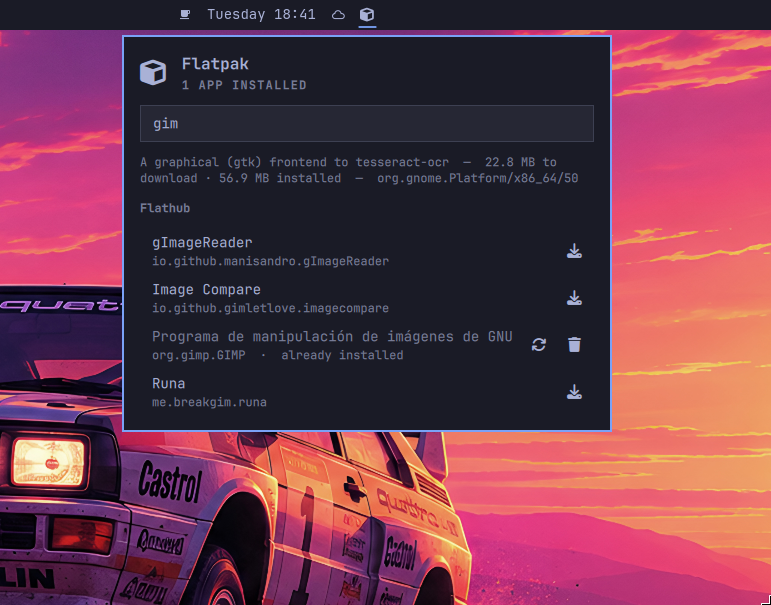

# Flatpak

A Flatpak manager for the Omarchy bar: browse Flathub, install apps, see what
is out of date, update, and remove — without leaving the panel.

The bar icon is the Nerd Font `nf-fa-cube` glyph (`U+F1B2`).

More screenshots

## Requirements

- **Omarchy** with the Quattro shell (the panel is a Quickshell widget).
- **Flatpak**. On Arch: `sudo pacman -S flatpak`. Check with `flatpak --version`.
- **A Flathub remote** for at least one installation. A user installation
  normally has none, and the first user-scope install adds it for you; to add it
  by hand:

      flatpak remote-add --user --if-not-exists flathub \
        https://dl.flathub.org/repo/flathub.flatpakrepo

Everything else the plugin shells out to ships with Omarchy and is not something
you need to install separately:

| Command | Provided by | Used for |
| --- | --- | --- |
| `flatpak` | Arch `flatpak` package | every listing, install, update and removal |
| `gum` | Omarchy | the prompts in the terminal |
| `sudo` | base | system scope only, interactive, never passwordless |
| `hyprctl` | Hyprland | reloading the session after the launcher fix |
| `omarchy-shell` | Omarchy shell | refreshing the panel after an action |
| `omarchy-notification-send` | Omarchy | the update notification |
| `omarchy-launch-floating-terminal-with-presentation` | Omarchy | running the scripts with a prompt |
| `omarchy-sudo-keepalive` | Omarchy | keeping a sudo timestamp alive while prompting |
| `bash`, `awk`, `mktemp` | base | the scripts themselves |

Nothing is downloaded from a network at install time, and the plugin installs no
packages of its own: if a dependency is missing the script says so instead of
fetching it.

## Install

    omarchy plugin add https://github.com/archlatam/flatpak --enable
    omarchy restart shell

`--enable` writes the bar entry into `shell.json`. It does not restart the
shell. Until the shell restarts the plugin is installed and enabled but nothing
is drawn on the bar.

Omarchy names the install directory after the plugin id, not after the
repository, so the plugin lands in
`~/.config/omarchy/plugins/io.github.archlatam.flatpak/` — the repository is
called `flatpak`, the id is `io.github.archlatam.flatpak`, and every
`omarchy plugin` command uses the id. If you ever change the id,
`~/.config/omarchy/shell.json` has a matching `"id"` entry in `bar.layout` that
has to change with it, or the widget silently disappears from the bar.

If you would rather look at the code first, clone it yourself and validate it:

    git clone https://github.com/archlatam/flatpak \
      ~/.config/omarchy/plugins/io.github.archlatam.flatpak
    omarchy plugin validate ~/.config/omarchy/plugins/io.github.archlatam.flatpak

**Cloning on its own enables nothing.** Omarchy treats a plugin as enabled when
it finds the id in `shell.json`, and `git clone` writes no `shell.json` at all.
A manually cloned plugin therefore stays invisible on the bar however healthy
it looks, and `omarchy plugin list` will call it `disabled`. To finish the job
by hand you need all three steps, in this order:

    omarchy-shell shell rescanPlugins
    omarchy plugin enable io.github.archlatam.flatpak center
    omarchy restart shell

`rescanPlugins` comes first because `omarchy plugin enable` asks the running
shell whether it knows the id, and a shell started before the clone does not.
The second argument of `enable` is where the widget sits on the bar (`center`,
`left` or `right`); it is optional.

Once the directory exists, `omarchy plugin add` on top of a manual clone stops
with `plugin is already installed`; use `omarchy plugin update` from then on, or
delete the directory and let `add` do the install.

## Update

    omarchy plugin update io.github.archlatam.flatpak

No `omarchy restart shell` needed here: the shell watches plugin directories and
reloads a changed one by itself. That covers *edits* to a plugin that is
already loaded. A plugin installed for the first time does need a restart,
because neither `add` nor `enable` restarts the shell themselves.

`omarchy plugin update` with no argument updates every git-managed plugin at
once.

## Uninstall

    omarchy plugin remove io.github.archlatam.flatpak

That deletes the plugin from `~/.config/omarchy/plugins/`. It removes **no
apps**: anything you installed with it stays installed until you remove it from
the panel, or with `flatpak uninstall`.

One thing is worth knowing before you remove it:

- The launcher fix, if you ever used it, writes `~/.config/hypr/envs.lua` and
  adds `require("hypr.envs")` to `hyprland.lua`. Both outlive the plugin on
  purpose — uninstalling a plugin should not edit your Hyprland config behind
  your back. Remove those two lines by hand if you want them gone.

## What it does

- **Installed apps**, listed with their scope and a marker when an update exists.
- **Update count** on the bar icon, next to the cube.
- **Search Flathub** by name. The catalogue is fetched once, on the first search,
  and reused from then on.
- **Install** from a search result, asking for the scope every time.
- **Update** one app or all of them, restricted to `--app` so runtimes are never
  touched by a routine update.
- **Remove** an app, after a confirmation, plus an optional sweep of leftover
  unused runtimes.
- **Refresh** (`r`, or middle click on the bar icon).
- **Update notification**, checked in the background on start and hourly after
  that: one desktop notification per session when a pending update appears, so
  a stale app does not have to be noticed by opening the panel.
- **Launcher check** on every open, with a one-click fix when the session cannot
  see Flatpak apps at all. See
  [Apps missing from the launcher](#apps-missing-from-the-launcher).

## Scope

The scope is asked on every install, because a user may want one app
system-wide and the next one kept private, and neither choice is wrong.

For updates and removals the scope is not asked: it is detected from where the
app is actually installed, since `flatpak uninstall` needs that installation
and "Only this user" would be wrong for a system-wide app.

Reading the catalogue is a third case, and it is not a choice the user makes.
`flatpak remote-ls flathub` with neither `--user` nor `--system` makes Flatpak
stop and ask which installation it meant, and it answers by reading stdin. From
a terminal that is a question you can be asked; from the status bar it is not,
because there is no terminal on the other end, so the catalogue comes back
empty and searching silently does nothing. So every catalogue query is scoped,
and the plugin picks the scope: the system remote if it has one, the user
remote otherwise. The system remote is preferred because it ships with the OS
while the user one usually does not, so the common case costs a single query. A
user who keeps Flathub only in their own installation is handled by retrying
there once. In `scripts/` this is `resolve_remote_scope`, and the panel holds
the same decision in `remoteScope`, shared by the catalogue query and the
per-app summary so the two cannot disagree.

A user installation usually has no Flathub remote yet, so the first install
into the user scope adds it. That is a no-sudo, one-time change confined to the
user installation; the system remote is never modified.

## Apps missing from the launcher

Flatpak writes its `.desktop` files into `<installation>/exports/share`, which is
not part of the default `XDG_DATA_DIRS`. Arch ships `/etc/profile.d/flatpak.sh`
to add those directories, but that only runs in login shells, so a Hyprland
session never picks them up and the launcher shows no Flatpak apps even though
they are installed and working. Nothing about the installation is broken; the
session is.

The panel checks for this every time it opens. When the session cannot see the
exports, a dim row with a wrench appears under the app list and its button
applies the fix:

    scripts/ensure-launcher-path --fix

`--fix` writes `~/.config/hypr/envs.lua`, but only when that file does not
exist. An `envs.lua` written by hand is never overwritten: if it is there and
does not already manage `XDG_DATA_DIRS`, the fix stops and says so rather than
guessing. When the file is the plugin's, or is yours and already handles the
variable, it adds the missing `require("hypr.envs")` to `hyprland.lua` — after
backing it up — then reloads Hyprland and restarts the shell. It is idempotent,
so running it twice changes nothing.

Once the exports are on `XDG_DATA_DIRS` there is nothing left to do. Quickshell
watches the export directories with inotify and rescans when they change, so an
app installed afterwards appears on its own; the shell does not need restarting
after every install.

With no arguments the script only reports, printing `ok` or `broken` and exiting
0 or 1. That is how the panel decides whether to show the row. `--status` prints
the same diagnosis in prose, for when you want to look rather than branch on it.

Nothing here happens on its own. The row only appears, and only the button
applies anything, so editing your Hyprland config always takes a deliberate
click. The check itself is a read-only run of the script, and it is the only
thing the panel does on open besides listing apps.

## Keys

The search field is focused as soon as the panel opens, so you can type right
away. Arrows still move the cursor over the results, because they are handled
on the field itself: `PanelKeyCatcher` is blocked while the field has focus, and
without that the results could not be reached at all.

| Key | Action |
| --- | --- |
| `r` | Refresh |
| `Enter` | Install (searching) or update (installed list) |
| `Delete` | Remove, with confirmation |
| `↑` `↓` | Move the cursor |
| `Esc` | Clear the search, or close the panel |

Each row also carries its own buttons, which follow what the app actually is:

| Row is | Buttons |
| --- | --- |
| Not installed | Install |
| Installed | Update, Remove |

So a Flathub hit you already have offers removal rather than a second copy,
and an installed app that is stale is one click from being updated.

Right click on the bar icon opens a standalone picker in a terminal, and middle
click refreshes.

## How it is put together

The panel is a status bar widget with no terminal to prompt on, so the split is
deliberate:

- **QML** (`BarWidget.qml`, `Panel.qml`) only runs read-only queries. It never
  prompts and never runs `sudo`.
- **Scripts** (`scripts/`) do everything that mutates state. The panel launches
  them with `bar.run` in an Omarchy floating terminal, where `gum` can prompt
  and `sudo` can ask for a password. A half-answered sudo inside the shell
  would wedge the whole desktop, which is the reason for the split.
- The single exception is the update notification. It prompts for nothing, needs
  no password and changes nothing, so it is sent straight from QML with
  `omarchy-notification-send` instead of through a terminal. It fires once per
  session and re-arms the next time the count returns to zero, so a panel that
  stays open does not repeat it. The panel keeps the bar badge and the panel
  list in step with the same number, so the notification is a nudge rather than
  the only place the information exists.

After an action finishes, the script calls
`omarchy-shell -q io.github.archlatam.flatpak-refresh refresh` so the panel picks up the new
state. That target is deliberately not the plugin id: the panel's own
`ipcTarget` already has an `IpcHandler` from `qs.Ui.Panel`, and Quickshell keeps
only the first handler registered for a target, so a second one there is
registered and then silently dropped.

The manifest declares the `bar-widget` kind only, and loads `Panel.qml` from
`BarWidget.qml` with a `Loader` instead of declaring a second `panel` kind. The
shell treats a plugin that is both as panel-loader-owned: `shell.summon
<id>` would stop routing to the live bar instance and would mount a second,
uninjected `Panel.qml` with no `bar`, which means no prompts and no buttons that
work. One kind, one instance.

## Catalogue metadata is untrusted

Everything the panel shows that came from Flathub is written by whoever
published the app: the display name, the app id, the version and the summary
from `flatpak remote-info`. An app on Flathub is not vetted for what it puts in
those fields, so the panel treats them as hostile.

That matters because of how Qt renders text. A `Text` element defaults to
`Text.AutoText`, which renders anything that looks like HTML as rich text, and a
rich-text document fetches the `src` of an `` tag. An app named
`` would therefore make the
status bar issue a request to a host the publisher chose, the moment somebody
searched the catalogue — with nothing clicked, and from the shell rather than
from `flatpak`. That is an unsolicited network request and a way to confirm that
a given machine is running this desktop.

So every `Text` in the plugin sets `textFormat: Text.PlainText`, which is what
the rest of the shell kit does too (`PanelHero`, `PanelToolTip`,
`OpticalGlyph`, `ConfirmDialog`). The rule is unconditional rather than applied
only to the fields that are currently untrusted: a `Text` added later without
the guard would be exploitable through whatever the author had not yet thought
to distrust. `test/flatpak-scripts.test.sh` asserts that every `Text` item in
every `.qml` here has the guard, so the omission fails the suite.

The app name also reaches the row tooltips (`Install <name>`) and the removal
dialog (`Remove <name>?`). Those are safe for the same reason, from the kit
side: `PanelToolTip` and `ConfirmDialog` already render as `PlainText`.

## Reloading after an edit

Plugin QML is only instantiated when the shell starts. `omarchy-shell shell
rescanPlugins` reloads the plugin registry but leaves the live widget in place,
so it does **not** pick up a QML edit. Use `omarchy restart shell`, which
restarts the shell properly (it refuses while the session is locked).

Do not chain `reloadConfig` with `restart shell`: the second one can start an
instance that then receives the first one's exit request and dies before it
finishes launching, which Quickshell reports as "crashed within 10 seconds of
launching". That is a restart race, not a QML fault.

## Tests

`scripts/` is covered by `test/flatpak-scripts.test.sh`: 51 cases, 161
assertions, all passing. It drives every script against stub `flatpak`, `gum`,
`sudo`, `hyprctl` and `omarchy` binaries, so the destructive branches can be
exercised without installing, updating or removing anything. It asserts on the
exact argv each script builds: that `sudo` is used for system scope and never
for user scope, that `update` carries `--app` and no bare ref, that `--unused`
only runs after a confirmation, that a declined or cancelled prompt changes
nothing, and that a missing `flatpak` is reported rather than worked around.
`ensure-launcher-path` is covered the same way: the check reports `ok`/`broken`
from the session environment alone (including the case where a directory merely
*contains* the exports path), `--fix` refuses to overwrite a hand-written
`envs.lua`, leaves an already-correct configuration byte-identical, places the
new `require("hypr.envs")` after the last personal module, and backs up
`hyprland.lua` before touching it.

The stub knows about installations separately, because the scoping rule in
[Scope](#scope) is only observable that way: `STUB_REMOTES_SYSTEM` and
`STUB_REMOTES_USER` model which installations have the Flathub remote, the stub
answers `Remote 'flathub' not found` for the ones that do not, and four cases
pin the behaviour — that no catalogue query goes out unscoped when the remote is
in both installations, that a panel-driven install still scopes its
availability check, that a user with the remote only in their own installation
is read from there, and that having it in neither is reported rather than
worked around.

The QML is covered statically rather than at runtime, by one case in the same
file: it counts the `Text` items in every `.qml` and asserts each one has a
`textFormat: Text.PlainText`, which is the guard described in *Catalogue
metadata is untrusted*. It also asserts `Panel.qml` still has at least one
`Text`, so the check cannot pass on an empty panel. That is what stands between
the fix and a future `Text` that forgets it.

The stubs replace the real binaries rather than shadowing them, including the
two Omarchy helpers the scripts source when they are on PATH: the real
`omarchy-sudo-keepalive` runs `sudo -v` and then a background `sudo -n` loop,
which is exactly what a test must not do.

Run it from a clone:

    ./test/flatpak-scripts.test.sh

One test name or fragment can be passed to run just those cases, which is the
fast way to work on a single script:

    ./test/flatpak-scripts.test.sh flatpak-remove

Then the static checks, which need the shell for `qmllint`:

    omarchy plugin validate .
    shellcheck -x scripts/* test/*.sh
    qmllint -I "$OMARCHY_PATH/shell" BarWidget.qml Panel.qml

Beyond that static case, the panel's behaviour has no automated test; check it by
hand with `omarchy restart shell` and a click on the bar icon. The one behaviour
worth exercising after any change to the manifest is
`omarchy-shell shell summon io.github.archlatam.flatpak '{}'`, which must open
the panel owned by the bar widget rather than a second instance of it.

Worth checking by hand once after any change to a `Text` that shows
publisher-controlled data: search Flathub for an app named
``. It has to render as those
literal characters, with no image and no request leaving the shell.

## License

MIT. See [LICENSE](LICENSE).

